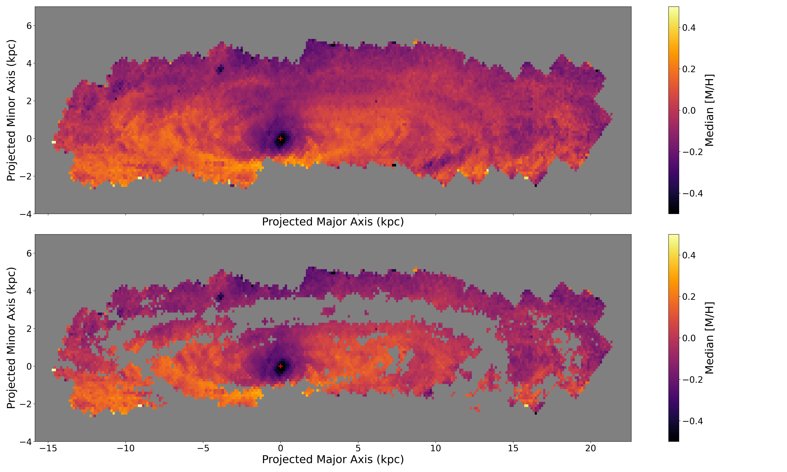
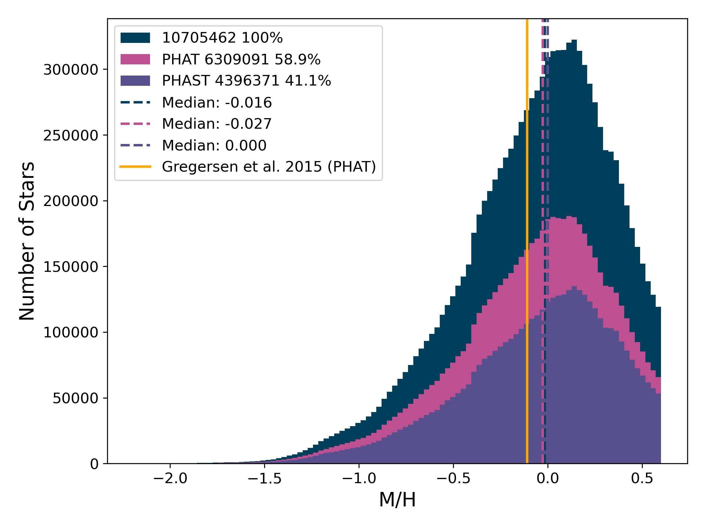
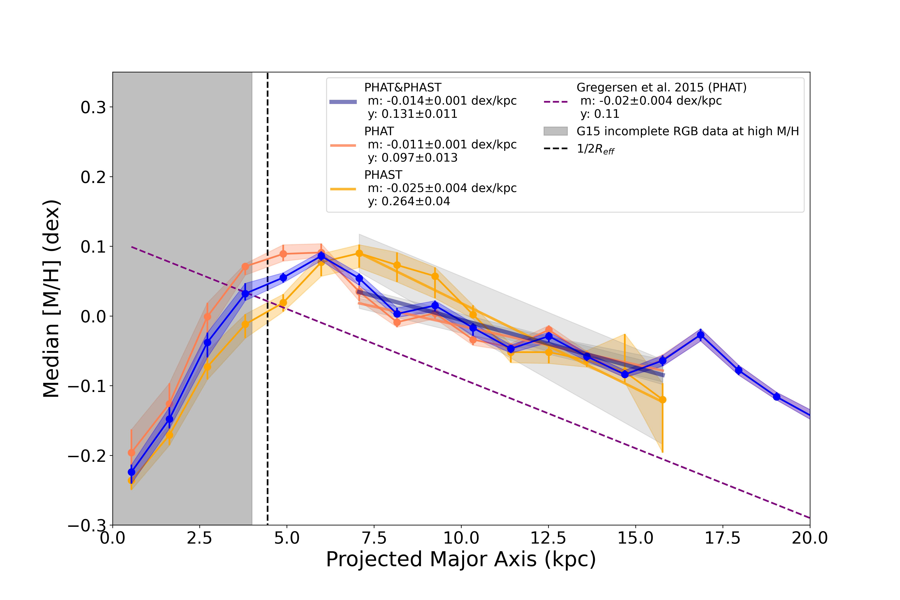
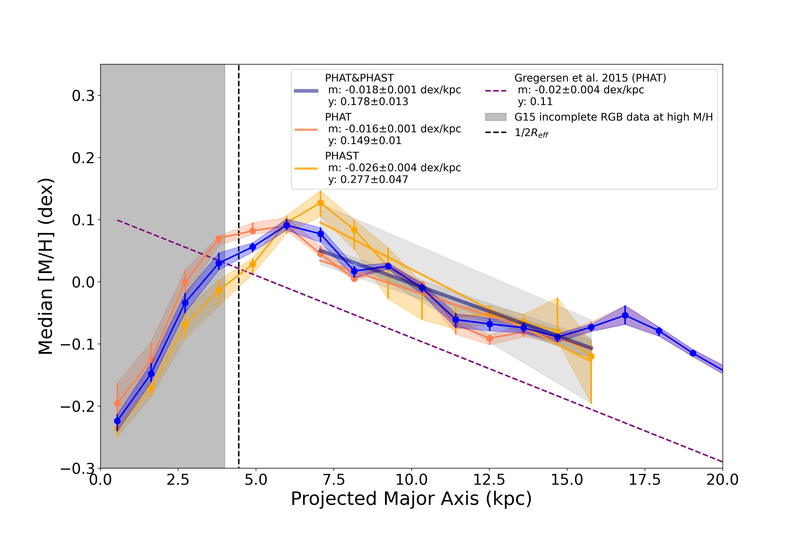

# M31 Red Giant Branch Stars Metallicity Distribution Function and Gradient

By Myles McKay(@mmckay18),

# Table of Contents

- [Introduction](#introduction)
- [Research Abstract](#research-abstract)
- [Data](#data) - [Data Sources](#data-sources) - [Data Acquisition](#data-acquisition) - [Data Preprocessing](#data-preprocessing)
- [Results and Evaluation](#results-and-evaluation)
  - [PHAT and PHAST RGB Spatial Metallicity Map](#phat-and-phast-rgb-spatial-metallicity-map)
  - [RGB Metallicity Distribution Function](#rgb-metallicity-distribution-function)
  - [RGB Metallicity Gradient](#rgb-metallicity-gradient)
- [Future Work](#future-work)
- [References](#references)
<!-- - [License](#license) -->

# Introduction

- This repo demonstrates the exploratory data analysis, statistical method and viusalization of PHAT and PHAST Red Giant Branch stars.

# Research Abstract

The Panchromatic Hubble Andromeda Southern Treasury (PHAST) (Chen et al. 2024) is an extension of the 2012 Panchromatic Hubble Andromeda Treasury (PHAT) (Dalcanton et al. 2012) that built a rich photometry catalog of the stars in the northern half of M31. We use the optical photomtry of the PHAST to select the RGB stellar population and isochrone models to estimate their stellar metallicity. The stars are then binned to $0.01^\circ$ square bins and we compute the median for metallicity. The median metallicity binned maps sampled in even elliptical bins and compute the median from the inner to outer radii to create the RGB metallicity gradient. Using the stellar photometry of RGB stars in M31, we measure the metallicity gradient in both the northern and southern halves and compare their gradients. The stars comes from the PHAT and PHAST HST surveys optical bands F475W and F814W. Metallicity is calculated from isochrone models using 2D linear interpolation methods, and an RGB selection box is applied to mitigate photometric bias and ensure completeness. Since dust in galaxies affects photometry and can lead to overestimation of metallicity, we use infrared observations to correct for dust effects. While the PHAT catalog includes IR observations, the PHAST catalog only has optical observations, so we use previous IR observations of M31 to measure high dust mass surface density. A previous study of the PHAT metallicity gradient reported a slope of $-0.02 \text{dex/kpc}$ for the northern half of M31, indicating that the RGB population is well-mixed throughout the disk, assuming a fiducial age of $4 Gyr$. In this chapter, we present the metallicity analysis of the PHAST catalog and the comprehensive RGB gradient obtained by combining the PHAT and PHAST catalogs. We find that M31 has a shallow metallicity gradient, with similar slopes $(-0.01 dex/kpc)$ for both the northern and southern halves, suggesting that the RGB stellar population is well-mixed throughout the disk.

# Data

## Data Sources

### Photometry Data

PHAT - https://archive.stsci.edu/hlsp/phat

PHAST - https://www.stsci.edu/cgi-bin/get-proposal-info?observatory=HST&id=16796

### Isochrone Model Table Data

CMD - http://stev.oapd.inaf.it/cgi-bin/cmd

### M31 Dust Map

Drain Spitzer Dust Mass Surface Density Maps - https://www.astro.princeton.edu/~draine/m31dust/m31dust.html

<!-- ## Data Acquisition -->

## Data Preprocessing

1. Apply good star criteria as outline in the [2]
2. Combine the photometry catalogs for PHAT and PHAST
3. Apply photometric cut to remove brighter stars than that 23 mag in F814W filter for the isochrone table and the photometry table
4. Use linear interpolation to match isochrone table and photometry table

<!-- # Code Structure -->

# Results and Evaluation

- **RGB Gradient:** M31 4 Gyr RGB stars have
  a metallicity gradient with a slope of −0.012 ±
  0.001dex/kpc. Our RGB metallicity gradient ex-
  cluding the high dust mass surface density shares
  a similar slope to the Gregersen et al. (2015) for
  the PHAT catalog and are 0.1 dex higher in metal-
  licity. The PHAST catalog show a steeper metal-
  licity gradient but within the error of the PHAT
  catalog. The metallicity gradient is impacted by
  the exclusion of high dust mass surface density.

- **Compare PHAT and PHAST RGB Gradient:** The PHAST catalog shows a noticeable increase in metallicity from 5 − 7.5kpc before gradually decreasing throughout the southern half of the disk. We present the 4Gyr metallicity gradient from ∼ 8.0 − 16kpc, the slope is −0.025 ± 0.005dex/kpc.

  We apply the exact same processing and data reduction of the PHAST catalog to the PHAT catalog and estimate the metallicity gradient. PHAThas a metallicity gradient slope of −0.009 ± 0.001dex/kpc from ∼ 8.0 − 16kpc. Our metallicity gradient is shallower than the previous study and could relate to the recent improvements to PHAT catalog highlighted in Williams et al. (2023) but it is currently unclear and future analysis will aim to explore the impact of the change in the catalog. PHAT and PHAST catalog are both have shallow metallicity gradient but the PHAST gradient is more than twice as steep as the northern half. The southern half has a slightly higher RGB metallicity than that of the northern half from 7.5 − 11.5kpc and then the metallicity are about the same to the outermost radii. The radial profiles and gradient do not significantly deviate. We interpret this result as the RGB stars are well mixed and distributed across the disk of M31.

- **Impact of High Dust Mass:** The metallicity gradient is slightly impacted by the exclusion of high dust mass surface density. We align and the IR dust maps of M31 to our maps of M31 and remove high dust mass surface density ΣM⊙kpc−2 ≥ 3.0 × 105 and then plot the radial profiles for both the PHAT and PHAST catalog. We find that the PHAT and PHAST have slopes of −0.015±0.001dex/kpc and −0.023±0.005 dex/kpc respectively from ∼ 8.0 − 16 kpc. Overall, the exclusion of high dust mass surface density does not significantly affect the metallicity gradient. Interestingly, at ∼ 6 − 9kpc the metallicity slightly increase when dust excluded resulting in an morpronounced peak in the metallicity profile. Further analysis is needed to determine the signifi-
  cance of this change if any.

- **Metal Rich Bar Feature:** M31 bar is approxi-
  mately between 3 − 7 kpc (Gregersen et al. 2015).
  In the M31 radial profile there is a clear the peak
  in RGB metallicity at ∼ 6 kpc before decreasing in
  the outer disk. The PHAST catalog shows to continue at the peak metallicity to about 8 kpc and the PHAT catalog show to have a similar metallicity at 5 kpc. Our change in metallicity for both the PHAT and PHAST catalog show noticeable changes where the metal rich bar approximately resides. Further, the region is unaffected by the removal of high dust mass surface density in agreement with Gregersen et al. (2015) that this is signs of a real change in stellar population. Future studies will measure do a more detailed study of the stellar population of the central bar.

## PHAT and PHAST RGB Spatial Metallicity Map

  
  
<b>Figure 1:</b> Maps of M31 RGB median metallicity assuming a fiduicial age of $4$ Gyr in $0.01$" square bins. The red cross shows the center of M31. The top map shows the original M31 RGB map and the bottom shows the map after excluding high dust mass regions, removing the well known dust ring of M31

## RGB Metallicity Distrubution Function

  
  
<b>Figure 2:</b>  M31 RGB metallicity distribution function using a flat fiducial age of 4 Gyr. The
blue, pink and purple histogram represent the complete M31 catalog(PHAT and PHAST),
PHAT and PHAST respectively, The dash lines are the median metallicity and the values are
displayed in the legend. We also include the the median metallicity of the PHAT catalog from
Gregersen et al. (2015) (∼ −0.11dex) in orange. These MDFs are not corrected for systemic
bias in metallicity but as discussed in Gregersen et al. (2015), the MDF is qualitatively the
same

## RGB Metallicity Gradient

### NO DUST REMOVAL

  
  
<b>Figure 1:</b> The median RGB metallicity gradient for the PHAT and PHAST catalogs. The
orange and yellow colors represent the PHAT and PHAST metallicity radial profile. The blue
line represent the median metallicity of the combined catalogs and the solid black line. The
solid black lines represent the line of best fit for the different maps. The median metallicity
shows to have a very shallow gradient with a slope 0.01dex/kpc in comparison to 0.02dex/kpc
Gregersen et al. (2015) gradient represented by the dashed purple line. Overall our result is
in agreement with the RGB metallicity distribution is constant through out the disk. The
grey represent the incomplete bulge region from Gregersen et al. (2015) to show where less
reliable measurements are in the the gradient. The vertical dash line represents the half light
radius Ref f (Courteau et al., 2011)

### DUST REMOVAL

  
  
<b>Figure 1:</b> The median RGB metallicity gradient excluding high dust mass surface density
regions Log(ΣM⋆,dust)[M⊙kpc−2] > 3e5 for the PHAT and PHAST catalogs. The orange
and yellow colors represent the PHAT and PHAST metallicity radial profile. The blue line
represent the median metallicity of the combined catalogs and the solid black line. The solid
black lines represent the line of best fit for the different maps. The median metallicity shows
to have a very shallow gradient with a slope 0.01dex/kpc in comparison to 0.02dex/kpc
Gregersen et al. (2015) gradient represented by the dashed purple line. Overall our result is
in agreement with the RGB metallicity distribution is constant through out the disk. The
grey represent the incomplete bulge region from Gregersen et al. (2015) to show where less
reliable measurements are in the the gradient. The vertical dash line represents the half light
radius Ref f (Courteau et al., 2011)

# Future Work

# References

[1] Dalcanton, J. J., Williams, B. F., Lang, D., et al. 2012, The Astrophysical Journal Supplement Series, 200, 18, doi: 10.1088/0067-0049/200/2/18

[2] Williams, B. F., Lang, D., Dalcanton, J. J., et al. 2014, The Astrophysical Journal Supplement Series, 215, 9, doi: 10.1088/0067-0049/215/1/9

[3] Gregersen, D., Seth, A. C., Williams, B. F., et al. 2015, The Astronomical Journal, 150, 189, doi: 10.1088/0004-6256/150/6/189

[4] Williams, B. F., Durbin, M. J., Dalcanton, J. J., et al. 2021, The Astrophysical Journal Supplement Series, 253, 53, doi: 10.3847/1538-4365/abdf4e

[5] Chen, Z., Williams, B., Lang, D., et al. 2024, in American Astronomical Society Meeting Abstracts, Vol. 243, American Astronomical Society Meeting Abstracts, 428.06
